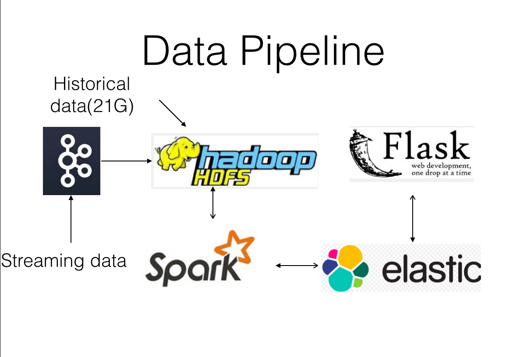
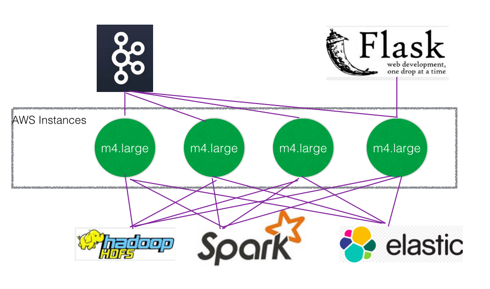

# StackOverIMP(Answer Me)
Answer Me is my big data project for the June 2016 session of Insight Data Engineering
#Intro
The system computes the historical data (synthesized) from stackoverflow.com, and then help users on stackoverflow.com to tag so that their questions can be answered faster.
Introduction link:http://www.slideshare.net/ChentaoZhang/sam-zhang-demo-64005772
##It makes use of the following technologies:
- Spark 1.4.0
- Elasticsearch 2.3.2
- Hadoop 2.7.2
- Kafka 0.9.0.1
- ZooKeeper 3.4.6

## Data Pipeline

## Cluster Deployment

